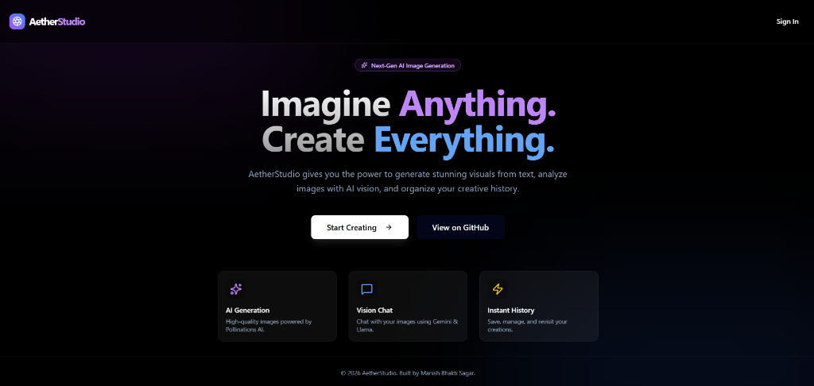
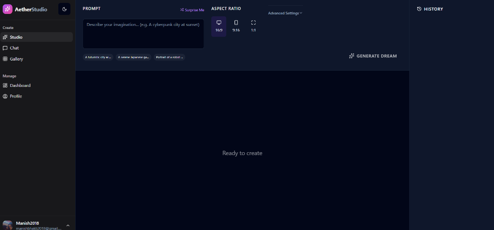
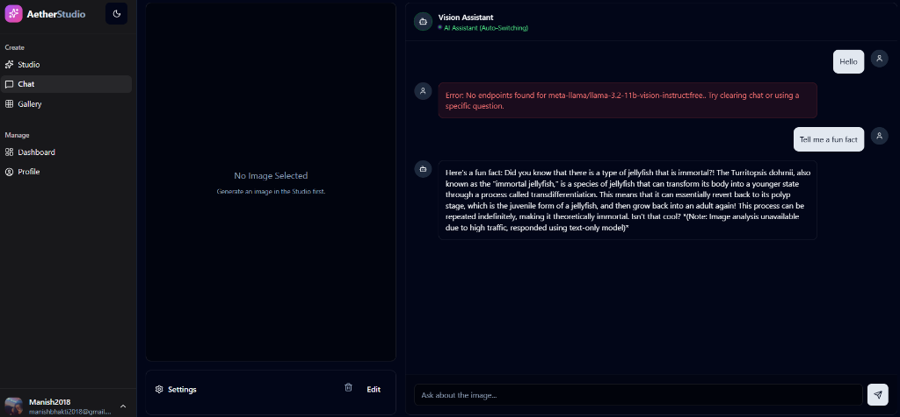
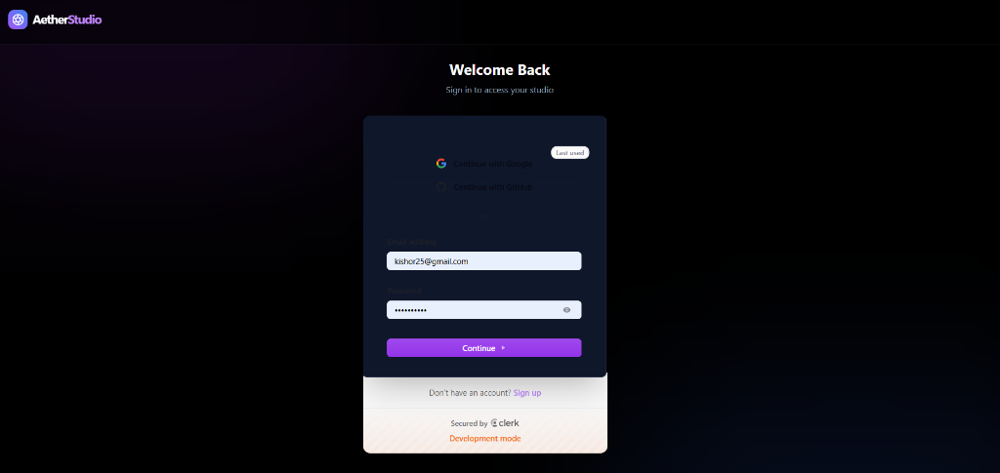
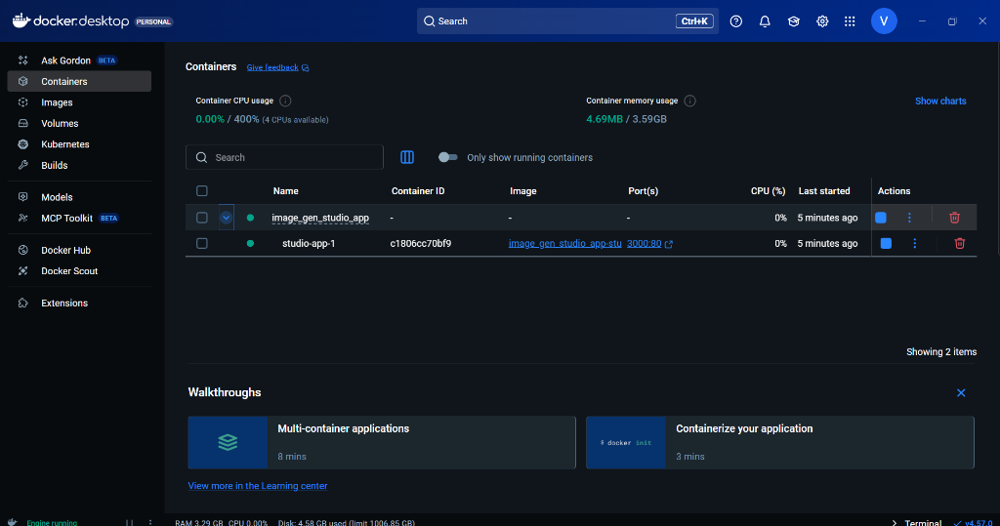

# AetherStudio 🎨✨

A premium AI-powered image generation studio built with React, featuring real-time database persistence and authentication.



## ✨ Features

- 🖼️ **AI Image Generation** - Generate stunning images from text prompts using Pollinations.ai
- 🔐 **User Authentication** - Secure sign-in with Clerk (Google, GitHub, Email)
- 💾 **Persistent History** - All generated images saved to Convex database
- 🎨 **Premium Dark UI** - Beautiful glassmorphism design with smooth animations
- 📱 **Responsive Layout** - Works on desktop and mobile devices
- 🗑️ **Manage History** - Delete images from your history with one click
- 💬 **AI Chat** - Chat about your generated images with AI vision

---

## 🛠️ Tech Stack

| Category | Technology |
|----------|------------|
| **Framework** | [React 19](https://react.dev/) + [Vite](https://vitejs.dev/) |
| **Styling** | [Tailwind CSS](https://tailwindcss.com/) + Vanilla CSS |
| **UI Components** | [Radix UI](https://www.radix-ui.com/) + [shadcn/ui](https://ui.shadcn.com/) |
| **Authentication** | [Clerk](https://clerk.com/) |
| **Database** | [Convex](https://convex.dev/) |
| **AI Image Gen** | [Pollinations.ai](https://pollinations.ai/) (Free) |
| **AI Chat** | [OpenRouter](https://openrouter.ai/) |
| **Icons** | [Lucide React](https://lucide.dev/) |
| **Routing** | [React Router v7](https://reactrouter.com/) |

---

## 📦 Installation

### Prerequisites

- Node.js 18+ 
- npm or yarn
- Clerk account (free): https://clerk.com
- Convex account (free): https://convex.dev

### 1. Clone the Repository

```bash
git clone https://github.com/Manish881-hub/Image-Gen-Studio.git
cd Image-Gen-Studio
```

### 2. Install Dependencies

```bash
npm install
```

### 3. Set Up Environment Variables

Create a `.env` file in the root directory:

```env
# Clerk Authentication
VITE_CLERK_PUBLISHABLE_KEY=pk_test_your_clerk_key_here

# Convex Database
CONVEX_DEPLOYMENT=dev:your-deployment-name
VITE_CONVEX_URL=https://your-deployment.convex.cloud

# OpenRouter API (Optional - for AI Chat)
VITE_OPENROUTER_API_KEY=sk-or-v1-your_key_here
```

### 4. Initialize Convex

```bash
npx convex dev
```

Follow the prompts to:
- Log in to your Convex account
- Create a new project
- This will automatically update your `.env` with Convex credentials

### 5. Start Development Server

In one terminal, run the Convex dev server:
```bash
npx convex dev
```

In another terminal, run the Vite dev server:
```bash
npm run dev
```

Open http://localhost:5173 in your browser.

---

## 🚀 Usage

### Generating Images

1. **Sign in** with your Google, GitHub, or email account
2. **Enter a prompt** describing the image you want to create
3. **Select aspect ratio** (16:9, 1:1, or 9:16)
4. **Click "Generate Dream"** to create your image
5. Your image appears in the main stage and is saved to history

### Managing History

- **Click any history item** to view it in the main stage
- **Hover and click the X** to delete an image from history
- **History persists** across sessions and devices

### AI Chat

- Navigate to the **Chat** page from the sidebar
- Ask questions about your generated images
- The AI can analyze and describe your creations

---

## � App Screenshots

| **Studio Interface** | **Vision Chat** |
|:---:|:---:|
|  |  |
| *Create images with prompt & advanced settings* | *Chat with AI about your generated images* |

| **Authentication** | **Profile & Settings** |
|:---:|:---:|
|  |  |
| *Secure login via Clerk* | *Manage your account and preferences* |

---

## �📁 Project Structure

```
studio/
├── convex/                 # Convex backend
│   ├── _generated/         # Auto-generated types
│   ├── schema.ts           # Database schema
│   └── images.ts           # Queries & mutations
├── src/
│   ├── components/         # React components
│   │   ├── ui/             # shadcn/ui components
│   │   ├── Studio.jsx      # Main studio component
│   │   ├── HistoryRail.jsx # Image history sidebar
│   │   ├── ImageStage.jsx  # Image display area
│   │   └── ...
│   ├── App.jsx             # Main app with routing
│   ├── main.jsx            # Entry point with providers
│   ├── App.css             # Global styles
│   └── index.css           # Tailwind & CSS variables
├── .env                    # Environment variables
└── package.json
```

---

## 🔧 Available Scripts

| Command | Description |
|---------|-------------|
| `npm run dev` | Start Vite development server |
| `npm run build` | Build for production |
| `npm run preview` | Preview production build |
| `npm run lint` | Run ESLint |
| `npx convex dev` | Start Convex dev server |
| `npx convex deploy` | Deploy Convex to production |

---

## 🌐 Deployment

### Deploy to Vercel

1. Push your code to GitHub
2. Connect your repo to [Vercel](https://vercel.com)
3. Add environment variables in Vercel dashboard
4. Deploy Convex to production:
   ```bash
   npx convex deploy
   ```
5. Update `VITE_CONVEX_URL` with production URL

### Deploy Convex

```bash
npx convex deploy
```

---

## 🐳 Run with Docker

You can containerize the application using Docker.

### 1. Build and Run

```bash
docker-compose up -d --build
```
This will start the application on `http://localhost:3000`.

### 2. Verify Container Content



To stop the container:
```bash
docker-compose down
```

---

## 🤝 Contributing

1. Fork the repository
2. Create a feature branch (`git checkout -b feature/amazing-feature`)
3. Commit your changes (`git commit -m 'Add amazing feature'`)
4. Push to the branch (`git push origin feature/amazing-feature`)
5. Open a Pull Request

---

## 📄 License

This project is open source and available under the [MIT License](LICENSE).

---

## 👨‍💻 Author

**Manish Bhakti Sagar**

- GitHub: [@Manish881-hub](https://github.com/Manish881-hub)

---

## 🙏 Acknowledgments

- [Pollinations.ai](https://pollinations.ai/) for free AI image generation
- [Clerk](https://clerk.com/) for authentication
- [Convex](https://convex.dev/) for the real-time database
- [shadcn/ui](https://ui.shadcn.com/) for beautiful components
